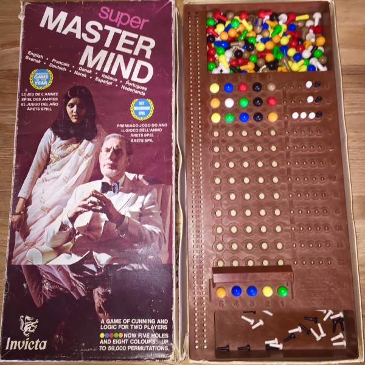
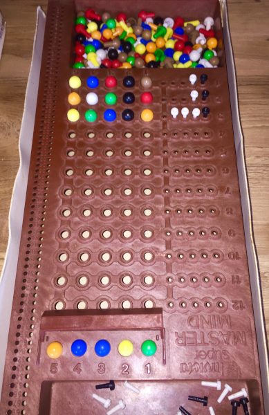
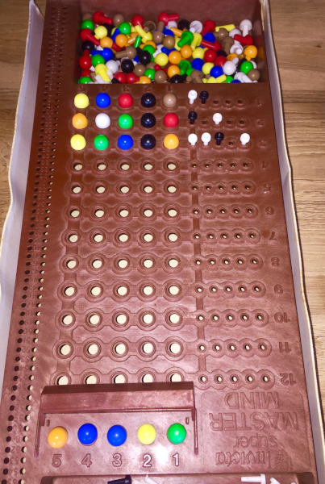

# super-master-mind

This is a toy project implementing a solver for the super-master-mind game, written in OCaml.

## What's so super about this master mind anyway ?

This is just the name of a particular variation of the famous master-mind game, which was commercialised by Invicta and popular in the 70th.

## Rules of the game

The person playing as code-maker chooses 5 code pegs amoung 8 colors (allowing color repetitions), and place them in the 5 holes code section, which is hidden to the code-breaker (the other player). The code-breaker will then submit up to 12 guesses to try and figure out the hidden code. The code-maker must respond to each guess by giving information back to the code-breaker by placing black and white key pegs in the holes alongside the guesses.

- a Black peg must be accounted for each of the code peg that is of the right color and at the right place;
- a White peg must be accounted for each of the code peg that is of the right color, but misplaced.

In case of color repetition, duplicate colors only get white pegs if the color is also duplicated in the secret code.

The pegs must be placed randomly and not indicate the actual position of the code pegs they are accounting. See for example:

This is the variation implemented by this repository.

### Alternative rules

A simpler version of the game can be played, when the pegs are placed exactly at the position of the code pegs they are referring to. For the example shown above, this would be played as shown here:

This variation is not implemented here.

## What does this repository implement ?

The repo contains a solver for the game, which is able to play as code-breaker.

The repo does not implement any user interface to play the game interactively. Rather, the motivation is simply to go over the algorithmic solving part of the game.

### Acknowledgements

The resolution algorithm was inspired by a video on solving the game Wordle, by YouTuber 3Blue1Brown. See it here:

- https://www.youtube.com/watch?v=v68zYyaEmEA

### OCaml dependencies : janestreet-bleeding

Currently this project depends on unstable version of Janestreet
librairies, and requires the opam switch to refer to janestreet
opam-repository located here:

https://github.com/janestreet/opam-repository

Once the ongoing refactoring of core/core_kernel/core_unix etc. lands
as an official release (perhaps v15 or so), I don't necessarily plan
on keeping the dependency to unstable libraries. TBD.
