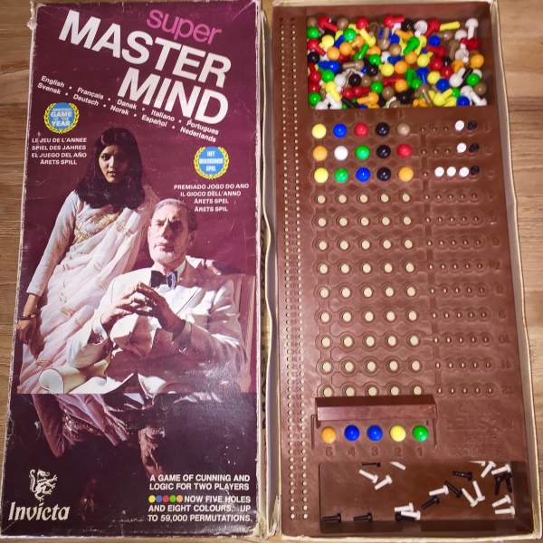
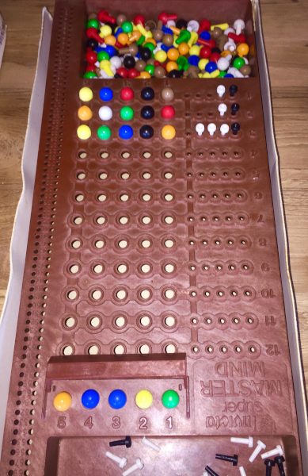

# super-master-mind

[](https://github.com/mbarbin/super-master-mind/actions/workflows/ci.yml)
[](https://coveralls.io/github/mbarbin/super-master-mind?branch=main)

This is a toy project implementing a solver for the super-master-mind game,
written in OCaml.

## What is the super-master-mind ?

This is the name of a particular variation of the famous master-mind game, which
was commercialized by Invicta and popular in the 70th.



## Rules of the game

The person playing as code-maker chooses 5 code pegs among 8 colors (allowing
color repetitions), and place them in the 5 holes code section, which is hidden
to the code-breaker (the other player). The code-breaker will then submit up to
12 guesses to try and figure out the hidden code. The code-maker must respond to
each guess by giving information back to the code-breaker by placing black and
white key pegs in the holes alongside the guesses.

- a Black peg must be accounted for each of the code peg that is of the right
  color and at the right place;
- a White peg must be accounted for each of the code peg that is of the right
  color, but misplaced.

In case of color repetition, duplicate colors only get white pegs if the color
is also duplicated in the secret code.

The pegs must be placed randomly and not indicate the actual position of the
code pegs they are accounting. See for example:



This is the variation implemented by this repository.

[Other rules](doc/other-rules.md) are possible, but there are not implemented
here.

## What does this repository implement ?

The repo contains a solver for the game, which is able to play as code-breaker.

The repo does not implement any user interface to play the game interactively.
Rather, the motivation is simply to go over the algorithmic solving part of the
game.

## Install

Releases for this project are published to a custom opam-repo. To add it to your
current opam switch, run:

```sh
opam repo add mbarbin https://github.com/mbarbin/opam-repository.git
```

Then you can install `super-master-mind` using a normal opam workflow.

```sh
opam install super-master-mind
```

## Running the code interactively

Run the following command to see the program play as code-breaker in the
terminal:

```bash
$ super-master-mind solver
```

You should see a prompt asking you to make sure you've selected a solution.
```
Press enter when done choosing a solution:
```

For example, let's assume our secret code is `(Green Yellow Blue Green Red)`. We
don't type it in, and just press ENTER.

The program will print a guess, and expects you to manually enter the number of
black and white pins at each round. For example:

```bash
...
(1 (Green Red Brown Blue Orange))
#black (correctly placed)  : ?
#white (incorrectly placed): ?
```

Here, the first `Green` peg is the only one correctly placed (1 peg). `Red` and
`Blue` are present but misplaced (2 pegs) and `Brown` and `Orange` are not part
of the secret code so don't account for a black nor a white peg. Thus we enter
`1` for black and `2` for white:

```bash
(1 (Green Red Brown Blue Orange))
#black (correctly placed)  : 1
#white (incorrectly placed): 2
(2 (White Red Brown Green Green))
etc....
```

The game will continues with new guesses until the program breaks the code.

## Code documentation

The code documentation of the latest release is built with `odoc` and published
to `GitHub` pages [here](https://mbarbin.github.io/super-master-mind).

## Motivations

The main motivation for me was to learn some concepts of information theory and
entropy:

Recently I have been playing Wordle with family. I watched a video on YouTube
made by 3Blue1Brown on solving Wordle (see the link in the Acknowledgements
section). As he puts it in the video, the game of Wordle is a good excuse to him
for an information theory lesson. I got inspired by his video, and thought that
the game of super-master-mind was well suited to implement some of the concepts
contained in the video.

## Acknowledgements

The resolution algorithm was inspired by a video on solving the game Wordle, by
YouTuber 3Blue1Brown. See it here:

- https://www.youtube.com/watch?v=v68zYyaEmEA
