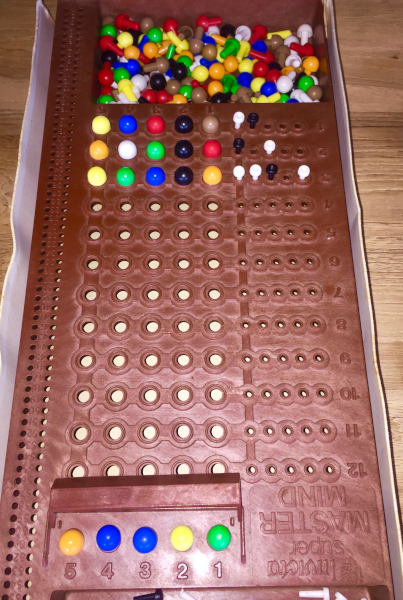

# Other rules for the game

A simpler version of the game can be played, when the pegs are placed
exactly at the position of the code pegs they are referring to. For
the example shown above, this would be played as shown here:

This variation is not implemented here.

